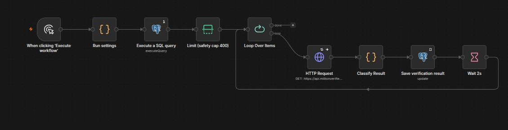
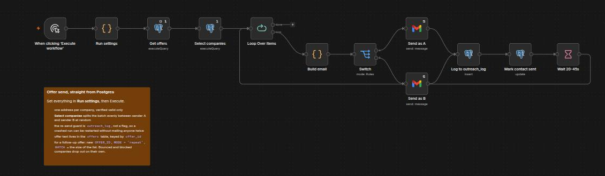
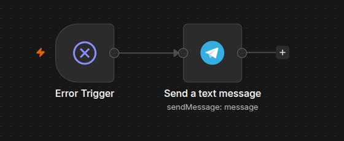

# n8n-outreach-ops

What happens to a CRM row *after* it has been enriched: verify the address,
send the offer straight from Postgres, log every send, alert on errors —
and the operating rule that came out of measuring it.

This is the second half of one pipeline. **[company-enrich](https://github.com/Naoi-7/company-enrich)**
turns a raw list into `companies` and `contacts` rows; this repo consumes
those rows. Same Postgres schema, same conventions: run that repo's
`schema.sql` first, then this one.

Three n8n workflows, one schema file, one seed. Built and run in production
at a small B2B food-trading company, where every send costs sender
reputation and every bounce is a number someone looks at.

## The problem

Enrichment gives you rows, not a mailing list. Three things stand between
a row and a sent email:

- **Which addresses are safe to send to.** A scraped or leaked address may
  be dead, malformed, or a certified-mail relay that refuses ordinary email.
  Verifiers answer this — for a fee per address — and their answer has more
  than two values. What do you do with "unconfirmed"?
- **How to send from the database, not a spreadsheet.** This process
  was migrated from Google Sheets to Postgres: the sheet had a row per
  company and a column per campaign, and every send meant a human reading
  it to decide who gets what. Once the data lived in Postgres, the
  selection could become a query with its guards built in.
- **How to make a crashed run harmless.** A send loop that dies at row 112
  of 275 must be restartable without mailing 112 companies twice, and
  without anyone reading logs to work out where it stopped.

## What it does

**`verify-contacts`** — draws a random slice of *companies* (not addresses)
from one source list, sends every unchecked address at those companies to a
verification API in batches of 10, maps the four answers onto the two the
schema allows, and writes the result back with a checked-at date.

- The draw is by company so "300" means a fair 300-company slice, not 300
  addresses clustered on a few firms.
- Addresses already bounced, already blocked, or malformed (a scraper wrote
  the literal string `not found` into some) are excluded before paying.
- Re-run guard: `verification_checked_at`. Stop and restart at any point,
  the same address is never paid for twice.
- Safety cap of 400 per run, 2 s between batches, an unknown API answer
  stops the run rather than being written as a guess.

**`send-from-postgres`** — picks one verified-valid address per company,
builds the email from an `offers` row and a per-sender signature, alternates
two sending mailboxes, logs every send to `outreach_log`, marks the contact,
and waits a random 20–45 s.

- **Two independent re-send guards, both on `outreach_log`, neither a
  flag.** Offer-level: a company that already has `offer:<id>` in this
  campaign can never get it again. Mode-level: `new` = no touch in any
  campaign ever; `repeat` = touched in this campaign, last touch at least N
  days old. A crashed run is restarted by clicking Execute.
- **Sender split by alternation over a random order.** A coin flip per row
  drifts 10–20 either way over a batch of 300; alternating over a shuffled
  batch gives an exactly even volume per mailbox and a random pairing. The
  assignment is made once in SQL and travels with the row, so greeting,
  send and log entry always belong to the same sender.
- All run parameters live in one Code node ("Run settings") with
  validation; a typo stops the run before it builds a query.

**`error-handler`** — the global Error Trigger, wired to a Telegram
message with workflow, node, error and execution id. Two nodes. Set it as
the error workflow on the other two.

## Numbers

From one production campaign on an older official-register list, 2026-09.

| | |
|---|---|
| Addresses verified | 310 (a random 300-company slice) |
| Valid | **282** — 192 deliverable · 45 catch-all · 45 unconfirmed |
| Invalid | 28 |
| Valid rate | 91% (two fresher lists ran 96–97% — list age is worth budgeting for) |
| Companies mailed, one address each | 275 |
| Bounces | **4 (1.5%)** |

Bounces by what the verifier had said:

| Verifier said | Sent | Bounced |
|---|---|---|
| Deliverable | 189 | **0** |
| Unconfirmed | 45 | 2 |
| Catch-all | 41 | 2 |

Every bounce was on an address the verifier could not confirm
individually. One of the four was a `554 PEC not allowed` — a national
certified-mail system that rejects ordinary email outright. That mailbox
will bounce forever; the company behind it is alive.

**The rule the data produced:** keep mailing "unconfirmed" and "catch-all"
addresses. 82 of the 86 delivered. Dropping a third of the list to avoid a
1.5% bounce rate loses far more prospects than it saves. Revisit only when
bounces pass ~5%, where sender reputation starts to suffer. And do not
block a company because one mailbox bounced — a dead address at a large
processor is not a dead company.

For honesty: these 275 sends produced no genuine reply. This is a
deliverability study, not a conversion one — the volume is too small for
the second question.

## How it works







```
company-enrich inserts companies + contacts
        │
        ▼
verify-contacts      Run settings → SQL (random company slice, unchecked only)
                     → cap 400 → loop ×10 → verifier API → classify 4→2
                     → UPDATE contacts (status, details, source, checked_at) → wait 2 s
        │
        ▼
send-from-postgres   Run settings → SELECT offers → SQL (one valid address per
                     company, both guards, A/B alternation) → loop → Build email
                     → Switch A/B → Gmail → INSERT outreach_log → UPDATE contact
                     → wait 20–45 s
        │
        ▼
error-handler        any failure → Telegram
```

Credentials to create in n8n (the JSON references them by name):

| Name | Type | Used by |
|---|---|---|
| `Postgres` | Postgres | both |
| `Verifier API` | HTTP Query Auth — the verifier's API key as a query parameter | verify-contacts |
| `Mail sender A` | Gmail OAuth2 | send-from-postgres |
| `Mail sender B` | Gmail OAuth2 | send-from-postgres |
| `Telegram alerts` | Telegram Bot API | error-handler |

The verifier here is MillionVerifier (`api.millionverifier.com/api/v3/`,
answers `ok` / `catch_all` / `unknown` / `invalid` / `disposable`). Any
service with a per-address endpoint fits — change the URL and the map in
"Classify Result".

## Run it

You need a running **n8n** (2.x), **Postgres** with
[company-enrich](https://github.com/Naoi-7/company-enrich)'s schema
already applied, two Gmail accounts (or any two mailboxes n8n can send
from), a verifier API key, and a Telegram bot for alerts.

```sh
psql -d <your_database> -f ../company-enrich/schema.sql   # if not done yet
psql -d <your_database> -f schema.sql                     # adds the columns + offers
psql -d <your_database> -f offers.example.sql             # one example offer
```

Then in n8n: import the three files from `workflows/`, create the five
credentials with the names above, put your chat id into `error-handler`,
replace the two placeholder signatures in `Build email`, and set the
error workflow on the other two.

To send: open `send-from-postgres`, edit **Run settings** (source tag,
offer id, mode, batch), Execute. Nothing else in the canvas needs touching.

## What I would change

- **Volume.** 275 sends is enough to learn the bounce rule and not enough
  to learn anything about replies. The next step is not a better workflow
  but a dedicated sending tool with warm-up and rotation — n8n is the
  right place for the logic, not for volume.
- **A per-run summary table.** Every number above was assembled by hand
  from `outreach_log` after the fact. One row per run (sent, bounced by
  verifier class, replies) would make the rule above a query, not a
  paragraph.
- **Sender config as data.** Names, signatures and the A/B labels sit in
  a Code node. A `senders` table would let the Switch grow to N mailboxes
  without editing JavaScript.
- **Bounce capture.** Bounces were read from the mailbox by hand and
  written to `contacts.email_status`. An IMAP or Gmail trigger that parses
  DSNs would close the loop.
